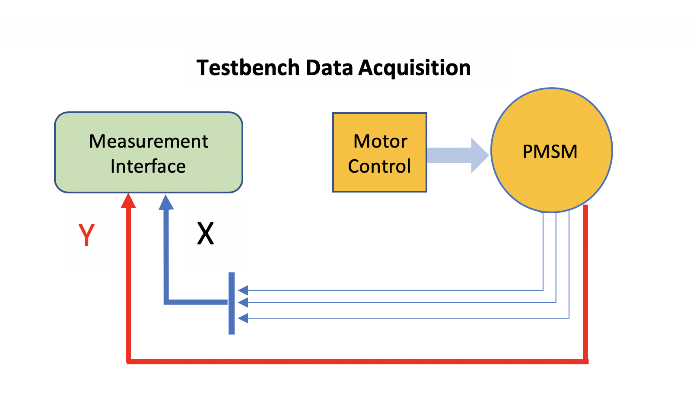
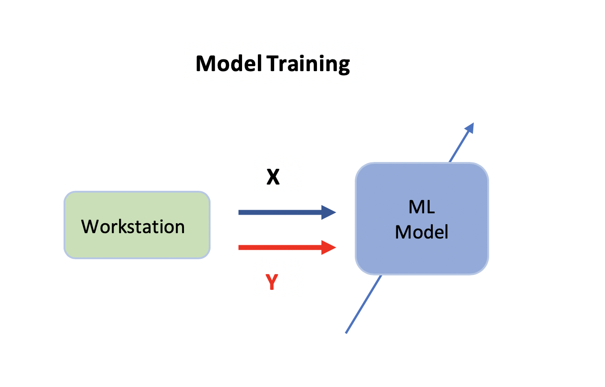
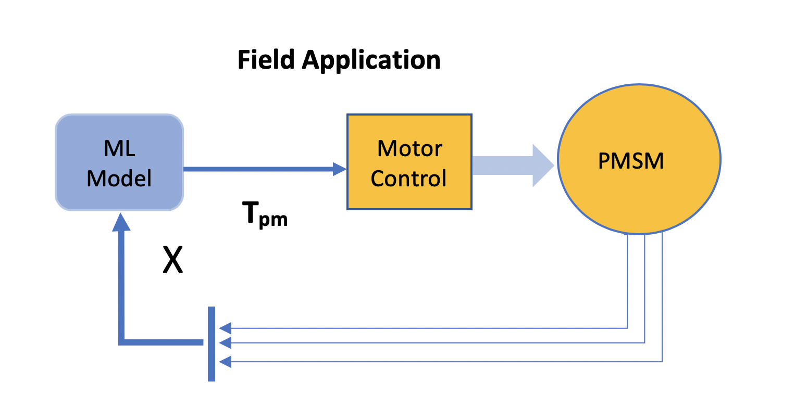
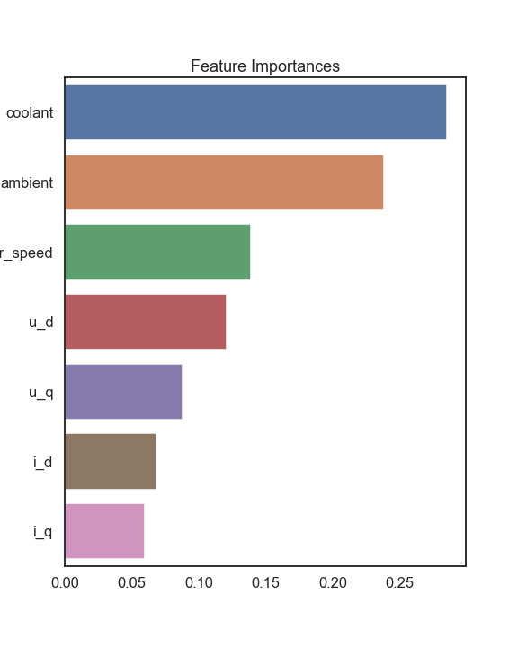
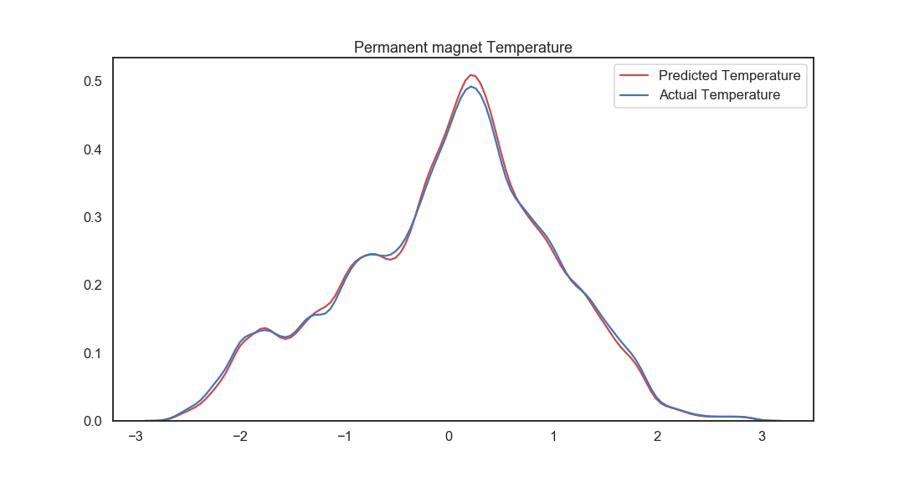

<h1 align='center'> Electric Motor Temperature Estimation </h1>

The aim of this project is to apply machine learning to estimate the temperature of the rotor of a electric motor (PMSM).

Most electric cars use permanent magnet synchronous motors (PMSM). The main motor components lack accurate temperature monitoring. High temperatures must be avoided at all times otherwise the consequences could be failing components like stator winding insulation which may melt and the permanent magnet could suffer from irreversible demagnetization. At the moment safe operation of the motor is ensured by oversized materials which increases production costs.

A sufficiently accurate prediction model would therefore eliminate the need for sensor measurements to determine the permanent magnet temperature. Other methods have been used in Engineering to predict the temperature although classic thermal modelling requires expertise in Thermodynamics and suffers restrictions when applied in real time the applications  

Temperature control of the elements of the motor are important as high temperatures in the permanent magnet could demagnetize it damaging the motor irreversibly.

By using linear regression model we can achieve a simple model with time-invariant properties which can be directly implemented in the real time control system of the motor.

* The following figures summarize this project stages :

  

The first stage consist of data is collected from the sensors 
 

  

This stage model training, summarizes the content of this repository, data is downloaded and search for the appropiate machine learning model
 

  

       At the final stage once the model is obtained it can be embedded into the control system of the electrical motor

 

If you are interested in this project and would like to discuss its details, please contact me directly at: 

*  [Email](abisixto@gmail.com)
*  [Linkedin](https://www.linkedin.com/in/abigail-sixto-b4b7211b/)

### Executive Summary

This project was inspired by a kaggle competition about the estimation of motor temperatures using machine learning.

The [dataset](https://www.kaggle.com/wkirgsn/electric-motor-temperature) is obtained from a technical lab at Paedorn University (Germany). 

The content of the notebook :

- Data extraction and exploration

- Data understanding and visualitazion

- Modelling linear regression

- baseline modelling

- Feature Engineering 2nd linear model

- Random Forest Regressor 

- Models evaluation and best model selection

- Testing best model

- Future improvements

### File descriptions

* [figures](./figures): Folder containing images used and saved on the notebook
* [Index.ipynb](./Index.ipynb): Main notebook , content desccribed above
* [README.md](./README.md): readme file
* [pmsm_temperature_data.csv](./pmsm_temperature_data.csv): dataset from kaagle.com
* [presentation.pdf](./presentation.pdf): short presentation (non-technical)

### Tecnologies Used:

* <strong>Python</strong>
* <strong>Pandas</strong>
* <strong>Numpy</strong>
* <strong>Matplotlib</strong>
* <strong>Seaborn</strong>
* <strong>Scikit-Learn</strong>

The inspiration for this project came while trying to combine Data Science and Engineering from my previous background. Sometimes having some background knowledge it helps to contextualize the data and make decisions about which variables to considered to build the model. In this case we were trying to avoid to temperatures as predictors.

The data set has over 100,000 readings, it's already cleaned and normalized. The initial stages of EDA I have explored the data, using visualizations that show the relationships of the variables. 

After all the visualitazions and choose the predictors for our target variable and split the data into training data and the test data I start the modelling trying linear regression models. I found the best performing model to be a Random Forest regressor. I have used Crossvalidation in all 3 tried models  and finally using Gridsearch I have fine tune the hyperparameters to obtained the best performing model.

From the final model I could extract feature importances to show which predictors account for a higher variation of the target variable <strong>Permanent Magnet Temperature</strong>

  

The final model scores were very good and after using the test data on the final model we have obtained the results shown below:

  

### Future improvements

- There are some issues on the notebook with saving the final model and need attention.

- It would be interesting to explore some deep machine learning models like residual convolutional and recurrent neural networks and compare the results with using linear regression

### More Information

The same dataset has inpired other publications:

[Deep Residual Convolutional and Recurrent Neural Networks for Temperature Estimation in Permanent Magnet Synchronous Motors](https://www.researchgate.net/publication/331982128_Deep_Residual_Convolutional_and_Recurrent_Neural_Networks_for_Temperature_Estimation_in_Permanent_Magnet_Synchronous_Motors)
     
[Empirical Evaluation of Exponentially Weighted Moving Averages for Simple Linear Thermal Modeling of Permanent Magnet Synchronous Machines](https://www.researchgate.net/publication/331976678_Empirical_Evaluation_of_Exponentially_Weighted_Moving_Averages_for_Simple_Linear_Thermal_Modeling_of_Permanent_Magnet_Synchronous_Machines)

